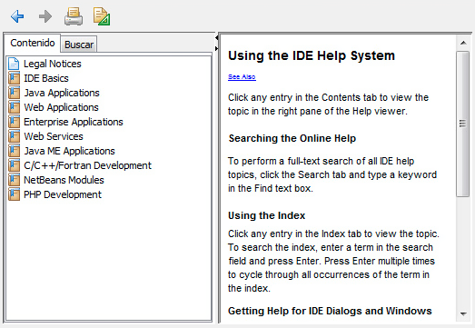
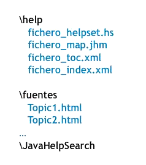
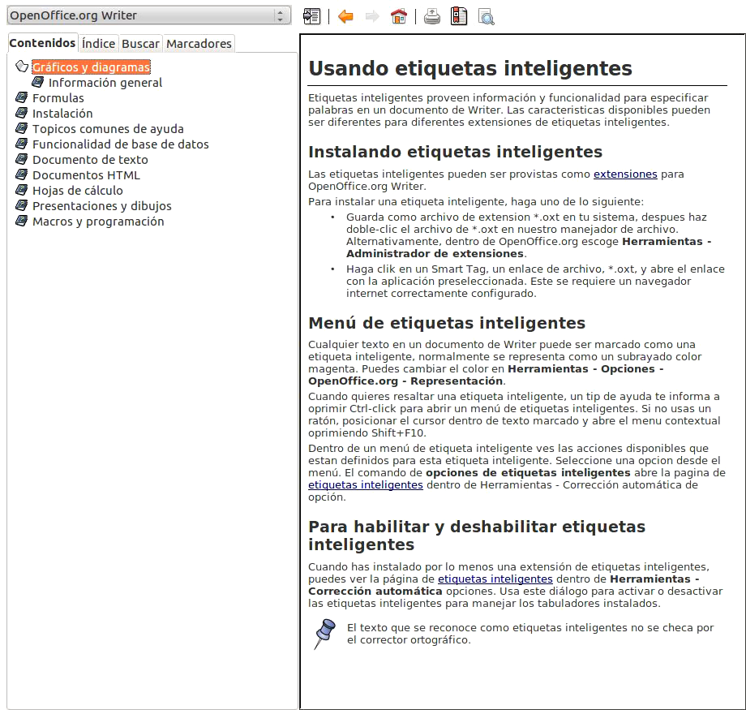

# **TEMA 6.** <br>Documentación de aplicaciones


| Anexos    | 
| --- |
| [Tarea DI06](../Práctica/Tareas/Tarea%20DI06.md)    |


## 1. Ficheros de ayuda

Los ficheros de ayuda son elementos esenciales en el desarrollo de aplicaciones informáticas. Proporcionan información sobre la instalación, configuración, uso y administración de un programa, sirviendo como guía para los usuarios. Estos ficheros suelen implementarse en diversos formatos, dependiendo de la plataforma, el lenguaje de programación o el entorno de desarrollo. Los formatos más comunes incluyen HTML y PDF.



En aplicaciones Java, se utiliza JavaHelp para generar ficheros de ayuda. Al activar JavaHelp, el sistema lee el archivo de ayuda especificado, que define la estructura y contenido de la ayuda. Un fichero de ayuda típico incluye:

- **Mapa del fichero.** Asocia identificadores de tema con URLs o rutas de archivos HTML.
- **Vista de Información.** Muestra la información mediante una tabla de contenidos, índice y búsqueda de texto completo.
- **Título del fichero.** Aparece en la barra de título de la ventana de ayuda.
- **Identificador de inicio (Home ID).** Define el tema que se muestra por defecto.
- **Presentación.** Ventanas donde se muestran los temas de ayuda.
- **Sub-Ficheros de ayuda.** Ficheros más pequeños que se fusionan para crear el fichero de ayuda principal.
- **Implementación.** Opcional, define la asignación de la clase HelpBroker y el visor de contenido.

JavaHelp requiere que la aplicación especifique la ruta al archivo de ayuda al iniciarse.

### Formatos ^sk

Cada lenguaje o entorno de programación implementa sus propios ficheros de ayuda. Los formatos más habituales son:

| Formato       | Descripción                                                                 |
|---------------|-----------------------------------------------------------------------------|
| **CHM**       | Ayuda HTML Compilado, propiedad de Microsoft. Incluye archivos HTML, tabla de contenidos e índice. |
| **HLP**       | Formato WinHelp, con archivos .hlp, .cnt (tabla de contenidos) y .gid (información de la ventana). |
| **IPF**       | Usado en sistemas IBM OS/2, compilado en archivos .inf o .hlp.              |
| **JavaHelp**  | Basado en XML, utilizado en aplicaciones Java.                              |
| **PDF**       | Abierto por visores PDF o herramientas de ofimática.                        |
| **MAML**      | Lenguaje basado en XML para asistencia en sistemas Microsoft.               |

- **CHM.** Permite compresión de datos, búsqueda y fusión de ficheros.
- **HLP.** Incluye archivos .hpj (proyecto), .rtf (contenido) y .shg (mapas de imagen).
- **IPF.** Similar a HTML, con 45 comandos básicos.
- **JavaHelp.** Visualizado en navegadores JavaHelp, basado en XML.
- **MAML.** Estructurado en preguntas frecuentes, glosarios, procedimientos y tutoriales.

## 2. Herramientas de <br>generación de ayudas

Las herramientas de generación de ayuda facilitan la creación de ficheros de ayuda para aplicaciones. Entre las más destacadas se encuentran:

**Help Workshop.** Desarrollado por Microsoft, esta herramienta permite crear ficheros de ayuda en formato HLP y CHM para aplicaciones de Windows y páginas web. Incluye funciones avanzadas como búsqueda de texto, favoritos y un editor de imágenes. Los archivos generados pueden incluir un índice, tabla de contenidos, claves de búsqueda e hiperenlaces. Además, soporta controles ActiveX y applets Java para su uso en navegadores web. Help Workshop también se utiliza para crear tutoriales y guías de usuario.

**JavaHelp.** Es la herramienta estándar para crear ayuda en aplicaciones Java. Proporciona un sistema completo con especificaciones, API y una implementación de referencia basada en Java Foundation Classes (JFC). JavaHelp permite agregar ayuda en línea a aplicaciones, componentes JavaBeans, applets y aplicaciones para servidor. Es independiente de la plataforma y funciona en cualquier navegador que soporte Java.

[Ejemplo de uso de JavaHelp](http://www.chuidiang.com/java/herramientas/javahelp/ejemplo-javahelp.php "Acceder al ejemplo de uso de JavaHelp (se abre en una ventana nueva).")

Otras herramientas relevantes incluyen:

- **RoboHelp.** Utilizado para crear sistemas de ayuda y documentación profesional para aplicaciones de escritorio y web, como .NET y aplicaciones dinámicas de Internet.
- **WINHELP.** Desarrollado por Microsoft para proporcionar ayuda en Windows 95 y versiones posteriores. Genera ficheros .HLP con una interfaz de tres paneles: tabla de contenidos, índice y búsqueda.
- **WEBHELP.** Basado en HTML y DHTML, funciona en cualquier plataforma.
- **Help Magician.** Popular para crear ayudas HTML o páginas web.
- **HelpMaker.** Permite crear ficheros de ayuda en formatos como WinHelp, RTF y HTML-Help. Incluye funciones de edición, ampliación, añadido de vínculos y corrección ortográfica.
- **DOCBUILDER.** Genera documentación y ayuda en formatos como HTML, RTF y archivos de ayuda de Windows. Soporta varios lenguajes de programación, como C/C++, Pascal y Delphi.

## 3. Ayuda genérica y <br>sensible al contexto

Toda aplicación informática incluye un sistema de ayuda externo al programa, cuyo objetivo es orientar al usuario sobre las funcionalidades y el uso de la aplicación. La ayuda genérica proporciona acceso a todos los contenidos de ayuda, permitiendo al usuario navegar por ellos o buscar términos específicos. Por otro lado, la ayuda sensible al contexto muestra información relevante según la situación o el elemento activo en la aplicación.

### Uso de JavaHelp ^sk

Para crear un sistema de ayuda con JavaHelp, se siguen los siguientes pasos:

1. **Creación de los temas de ayuda (topics).** Se definen los temas de ayuda en formato HTML, organizándolos jerárquicamente.

2. **Creación de los ficheros metadatos JavaHelp.** Se generan varios ficheros para organizar la información y facilitar la navegación y búsqueda:
   - **Fichero map.** Asocia los ficheros HTML e imágenes con identificadores. Su sintaxis es XML y tiene la extensión `.jhm`.
   - **Fichero HelpSet.** Fusiona y configura todos los ficheros de ayuda. Es referenciado por la aplicación y tiene la extensión `.hs`.
   - **Fichero TOC (Tabla de contenidos).** Describe la distribución de los contenidos en la tabla de contenidos.
   - **Fichero Índice.** Define la distribución y contenido del índice.
   - **Fichero de búsqueda.** Genera una base de datos de búsqueda utilizando la herramienta `jhindexer`.



Ejemplo de ejecución de `jhindexer`:

```bash
jhindexer directorio_con_archivos_de_ayuda
```

Para verificar la búsqueda:

```bash
jhsearch JavaHelpSearch
```

3. **Encapsulación en ficheros JAR.** Una vez finalizada la generación del sistema de ayuda, se puede encapsular en un fichero JAR para su distribución.

Ejemplo de creación de un fichero JAR:

```bash
jar -cvf ayuda.jar *
```

Para ver los archivos incluidos en el JAR:

```bash
jar -tvf ayuda.jar
```

Para extraer los archivos del JAR:

```bash
jar -xvf ayuda.jar
```

4. **Añadir ayuda a aplicaciones Java.** Para incorporar la ayuda en una aplicación Java, se utilizan las clases `HelpSet` y `HelpBroker` del paquete `javax.help`.

Ejemplo de importación:

```java
import javax.help.*;
```

Métodos clave de `HelpBroker`:

- `enableHelpKey`: Habilita la tecla de ayuda sobre un componente.
- `enableHelpOnButton`: Despliega la ayuda al presionar un botón o elemento del menú.
- `enableHelp`: Indica el tema de ayuda a mostrar al pulsar la tecla de ayuda sobre un componente.

Ejemplo de uso de `HelpSet` y `HelpBroker`:

```java
HelpSet hs = HelpSet.findHelpSet(null, "ruta/al/helpset.hs");
HelpBroker hb = hs.createHelpBroker();
hb.enableHelpKey(componente, "id_tema", hs);
```

Este proceso permite integrar un sistema de ayuda robusto y funcional en aplicaciones Java, facilitando la experiencia del usuario.

## 4. Tablas de contenidos

Las tablas de contenidos (TOC, Table of Content) son una parte fundamental del sistema de ayuda de una aplicación. Organizan los temas de ayuda en una estructura jerárquica, similar a las carpetas de un administrador de archivos. Cada ítem de la lista representa un tema principal, y puede expandirse para mostrar subtemas más específicos.



La profundidad de los niveles en la tabla de contenidos depende del tamaño y el detalle del diseño de la ayuda. Cuando el usuario selecciona un tema en la tabla de contenidos, se muestra el texto asociado a ese tema en la ventana de ayuda. La navegación entre temas se realiza mediante hipervínculos incrustados en el texto.

En JavaHelp, la tabla de contenidos se crea mediante un fichero TOC, cuya sintaxis está basada en XML. Este fichero describe la estructura y distribución de los temas en la tabla de contenidos.

## 5. Índices

El índice es una lista de palabras clave ordenadas alfabéticamente que facilita el acceso a términos específicos dentro de la ayuda. Funciona como un glosario o guía de definiciones, aclarando conceptos o procedimientos relacionados con la aplicación. Por ejemplo, en una ayuda sobre el lenguaje de programación Java, las palabras reservadas del lenguaje serían palabras clave.

Para acceder al índice, el usuario puede navegar por una lista de términos o buscar directamente en un campo de texto. En aplicaciones Java con JavaHelp, se utiliza la herramienta `jhindexer` para crear la base de datos de búsqueda necesaria para el índice. El fichero de generación del índice está en formato XML.

## 6. Sistemas de búsquedas

El sistema de búsqueda permite al usuario encontrar todas las referencias de un término específico dentro de la ayuda. El usuario introduce la palabra a buscar en un campo de texto y activa la búsqueda. El sistema muestra las páginas de ayuda donde aparece el término, resaltando las ocurrencias en el texto.

En aplicaciones Java con JavaHelp, se utiliza la herramienta `jhsearch` para realizar búsquedas en la base de datos generada por `jhindexer`. Esta herramienta busca el término en toda la ayuda y muestra los resultados relevantes. La sintaxis para ejecutar `jhsearch` es:

```bash
jhsearch JavaHelpSearch
```

Este sistema de búsqueda mejora la experiencia del usuario, permitiéndole encontrar información específica de manera rápida y eficiente.

## 7. Incorporación de ayuda <br>a la aplicación

El sistema de ayuda en una aplicación puede desarrollarse con herramientas externas y no necesariamente como una función del entorno de desarrollo. Una vez desarrollada la interfaz gráfica de la aplicación, es necesario implementar e integrar el sistema de ayuda para que forme parte integral de la aplicación. A continuación, se describe cómo incorporar ayuda implementada con JavaHelp en una aplicación Java.

En el proyecto, se utilizan las siguientes clases:

- **URL** (del paquete `java.net`): Representa una URL para identificar un recurso.
- **HelpSet** y **HelpBroker** (del paquete `javax.help`): 
  - `HelpSet` permite gestionar los datos del sistema de ayuda (ficheros HelpSet, map, tabla de contenidos, índices y topics).
  - `HelpBroker` gestiona la visualización de la ayuda en la aplicación, con métodos como:
	- `enableHelpKey`: Habilita la tecla de ayuda (F1) sobre un componente.
	- `enableHelpOnButton`: Despliega la ayuda al presionar un botón o elemento del menú.
	- `enableHelp`: Especifica el tema de ayuda a mostrar al pulsar la tecla de ayuda sobre un componente.

**Para incorporar la ayuda a la aplicación, se siguen los siguientes pasos:**

1. **Importar los paquetes necesarios.**

   ```java
   import javax.help.*;
   import java.net.*;
   ```

2. **Localizar y crear el fichero HelpSet.**

   ```java
   try {
       URL hsURL = HelpSet.findHelpSet(null, "ayuda/ayuda.hs");  // Localiza el fichero HelpSet
       HelpSet hs = new HelpSet(null, hsURL);  // Crea un objeto HelpSet
   } catch (Exception ex) {
       JOptionPane.showMessageDialog(this, "Fichero HelpSet no encontrado");
       return;
   }
   ```

3. **Crear un objeto HelpBroker.**

   ```java
   HelpBroker hb = hs.createHelpBroker();  // Crea un objeto HelpBroker
   ```

4. **Asociar la ayuda a un botón o elemento del menú.**

   ```java
   hb.enableHelpOnButton(jButton1, "introducción", hs);  // Asocia la ayuda a un botón
   ```

5. **Asociar la ayuda sensible al contexto a un componente.**
   - Hacer que el componente responda a la tecla de ayuda (F1):

	 ```java
     hb.enableHelpKey(getRootPane(), "introduccion", hs);
     ```

   - Asociar una página de ayuda a cada componente:

	 ```java
     hb.enableHelp(jButton1, "guardar", hs);  // Asocia la ayuda al botón "guardar"
     hb.enableHelp(jButton2, "abrir", hs);    // Asocia la ayuda al botón "abrir"
     ```

Este proceso permite integrar un sistema de ayuda robusto y funcional en aplicaciones Java, mejorando la experiencia del usuario al proporcionar acceso rápido y contextual a la información de ayuda.

## 8. Tipos de manuales

Durante el desarrollo de una aplicación, los desarrolladores generan documentación del código para facilitar el mantenimiento y la corrección de errores. Sin embargo, los usuarios finales suelen desconocer el código, por lo que es necesario crear manuales que faciliten la instalación, configuración, uso, mantenimiento, actualización y eliminación de la aplicación. Estos manuales suelen distribuirse en formato electrónico, aunque también pueden imprimirse.

Los tipos de manuales más comunes son:

- Manual de usuario.
- Guía de referencia.
- Guías rápidas.
- Manuales de instalación.

### 8.1. **Manual de usuario**

El manual de usuario es un documento técnico que proporciona asistencia a los usuarios de un sistema. Suele incluir información detallada sobre la instalación, configuración y uso de la aplicación, acompañada de capturas de pantalla. Las secciones típicas de un manual de usuario incluyen:

- **Portada y página de copyright.**
- **Prólogo.** Detalles sobre documentos relacionados y cómo navegar por el manual.
- **Tabla de contenidos.** Índice de los temas cubiertos.
- **Guía de uso.** Explicación de las funciones básicas de la aplicación.
- **Solución de problemas.** Descripción de problemas comunes y cómo resolverlos.
- **FAQ (Preguntas frecuentes).** Lista de preguntas y respuestas comunes.
- **Glosario e índice.** Definiciones de términos técnicos y referencias rápidas.

Aunque tradicionalmente se distribuían en papel, hoy la mayoría de los manuales de usuario están en formato electrónico.

### 8.2. **Guía de referencia**

La guía de referencia es un manual detallado destinado a usuarios experimentados. Proporciona información técnica específica, como listas de comandos, sintaxis de lenguajes de programación o mensajes de error. Es común en entornos de desarrollo o aplicaciones que requieren conocimientos especializados.

Por ejemplo, una guía de referencia para un entorno de desarrollo incluiría la sintaxis y palabras reservadas de un lenguaje de programación, como Java.

### 8.3. **Guías rápidas**

Las guías rápidas ofrecen una versión resumida de un manual, ideal para usuarios que necesitan información básica de forma rápida. Son útiles en los siguientes casos:

- Aplicaciones con configuración única.
- Aplicaciones con funcionalidad limitada.
- Documentación extensa, donde la guía rápida cubre las tareas principales.
- Usuarios con poco tiempo para formación.

Para diseñar una guía rápida, se debe:

1. Evaluar el contenido del manual completo.
2. Seleccionar las tareas más importantes.
3. Diseñar el documento con contraste, repetición, alineación y proximidad para mejorar la legibilidad.

### 8.4. **Manuales de instalación**

Los manuales de instalación están dirigidos a administradores de sistemas y usuarios con privilegios de instalación. Proporcionan información detallada sobre:

- Archivos que componen la aplicación.
- Requisitos de hardware y software.
- Modificaciones necesarias en el sistema anfitrión.
- Instalación de software adicional (por ejemplo, la máquina virtual Java).

Aunque los instaladores automatizados han reducido la necesidad de manuales de instalación, siguen siendo útiles en aplicaciones complejas o entornos multiusuario.

### 8.5. **Configuración y administración**

Cuando una aplicación requiere un proceso complejo de configuración y administración, como en aplicaciones cliente-servidor o con bases de datos, es necesario documentarlo. Los manuales de configuración y administración incluyen:

- **Configuración.** Valores de variables y personalización de la aplicación.
- **Administración.** Comandos, mantenimiento del sistema y solución de problemas.

En sistemas como Linux, la configuración puede implicar la modificación de scripts de texto plano, lo que requiere instrucciones detalladas para evitar errores.

### 8.6. **Destinatarios y estructura**

Los manuales están dirigidos a diferentes tipos de usuarios:

- **Administradores del sistema.** Manuales de instalación, configuración y administración.
- **Usuarios experimentados.** Manuales de usuario, guías rápidas y guías de referencia.
- **Usuarios poco experimentados.** Guías rápidas y manuales de usuario.

La estructura recomendada para un manual incluye:

| Componente                     | Descripción                                                                 |
|--------------------------------|-----------------------------------------------------------------------------|
| **Dato identificativo**         | Título que identifica el documento.                                         |
| **Tabla de contenidos**         | Lista de apartados y subapartados con números de página.                    |
| **Lista de ilustraciones**      | Número y título de cada figura.                                             |
| **Introducción**                | Objetivo del documento y breve descripción de los contenidos.               |
| **Información de uso**          | Sugerencias para usar eficientemente la documentación.                      |
| **Procedimientos**              | Instrucciones para completar tareas específicas.                            |
| **Información de comandos**     | Descripción de los comandos soportados por el software.                     |
| **Mensajes de error**           | Descripción de errores comunes y cómo resolverlos.                          |
| **Glosario**                    | Definición de términos técnicos.                                            |
| **Fuentes de información**      | Referencias a otros documentos relacionados.                                |
| **Elementos de navegación**     | Herramientas para moverse por el documento.                                 |
| **Índice**                      | Lista de términos clave y páginas donde aparecen.                           |
| **Capacidad de búsqueda**       | En documentos electrónicos, facilidad para buscar términos específicos.     |

La usabilidad de un manual se refiere a la facilidad con la que los usuarios pueden encontrar y utilizar la información necesaria.

## 9. Confección de <br>tutoriales multimedia

Un tutorial multimedia combina diferentes recursos (imágenes, vídeos, sonidos, animaciones, gráficos, enlaces externos, etc.) para ofrecer información visualmente atractiva sobre un tema, software o herramienta. La calidad de un tutorial multimedia depende de una buena base de información y del uso adecuado de recursos complementarios, adaptados al tipo de usuario al que va dirigido.

### 9.1. **Herramientas de captura de pantalla**

Las capturas de pantalla son esenciales para crear manuales y tutoriales multimedia. Permiten capturar imágenes del escritorio, ventanas o áreas específicas, que luego pueden editarse e incrustarse en documentos. Algunas formas de realizar capturas de pantalla incluyen:

- **Tecla PrintScr (Impr Pant).** Captura toda la pantalla.
- **Alt + PrintScr.** Captura solo la ventana activa.
- **Herramienta Recortes (Windows).** Permite capturar áreas específicas.

Además, existen herramientas especializadas para capturas de pantalla, como:

- **Snagit.** Captura ventanas, texto, vídeos y recursos web.
- **Hypersnap DX.** Captura aplicaciones DirectX y áreas seleccionadas.
- **Screenshot Captor**, **Easy Capture**, **WinSnap.** Otras opciones populares.

Para la creación de **videotutoriales** (screencasts), se utilizan herramientas como:

- **CamStudio**, **Camtasia**, **Jing**, **Matchware ScreenCorder**, **Adobe Captivate.**

### 9.2. **Secuencia de acciones**

La forma más simple de capturar una pantalla es usando la tecla **Impr Pant**, que guarda la imagen en el portapapeles. Luego, se puede editar con programas como **Paint** y exportar a formatos como BMP, JPG o GIF. Para capturas en vídeo, se requieren herramientas específicas, que siguen una secuencia similar:

1. Iniciar la grabación.
2. Realizar las acciones en pantalla.
3. Detener la grabación y guardar el archivo.

## 10. Herramientas de confección <br>de manuales interactivos

Existen diversas herramientas, tanto de software libre como comercial, para crear tutoriales interactivos. Algunas de las más destacadas son:

- **Adobe Captivate** (comercial): Ampliamente utilizado para crear tutoriales multimedia.
- **Wink** (libre): Permite capturas de pantalla, vídeos, y añadir explicaciones, botones y títulos.
- **Malted** (libre): Utilizado por el Ministerio de Educación, permite crear ejercicios y unidades de trabajo basadas en XML, con texto, imágenes, audio y vídeo.

### Simulación ^sk

La simulación es una técnica común en tutoriales multimedia, especialmente en el ámbito educativo. Permite a los usuarios explorar y simular el uso de una aplicación, interactuando con el tutorial a través del teclado y el ratón. Los tutoriales interactivos pueden incluir vídeos, imágenes y sonidos para aumentar el realismo de la simulación.

En el contexto del **e-learning** (aprendizaje electrónico), las simulaciones son especialmente útiles. Permiten:

- Resolver problemas y adquirir conocimientos de manera interactiva.
- Evaluar el aprendizaje y adaptarse a las necesidades del profesorado y alumnado.
- Crear historias basadas en la realidad, fomentando la interacción en el proceso de enseñanza.

Las simulaciones en educación pueden incluir vídeos con caricaturas hipotéticas o escenarios realistas, lo que facilita la comprensión y el engagement del alumnado.
