# **Tema 2.** <br>Introducción a  Flutter

## 1. Visión general

**Objetivo**

- Los diseños en Flutter se construyen con **widgets**.
- Los widgets son clases utilizadas para construir interfaces de usuario.
- Se pueden combinar widgets simples para crear estructuras más complejas.

En Flutter, casi todo es un **widget**, incluidos los modelos de diseño, imágenes, iconos y texto. También hay widgets invisibles, como filas, columnas y cuadrículas, que organizan los elementos en la pantalla.

|Conceptos clave| |
|---|---|
|**Widget**|Unidad básica de la interfaz en Flutter.|
|**Container**|Widget que permite agregar márgenes, relleno, bordes o color de fondo.|
|**Row & Column**|Widgets que organizan otros widgets en disposiciones horizontales y verticales.|

## 2. Ejemplo conceptual

El siguiente ejemplo muestra tres iconos con etiquetas y su disposición en filas y columnas.

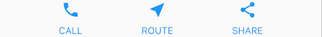

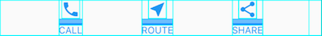

El siguiente diagrama representa la estructura de widgets utilizada en el diseño:
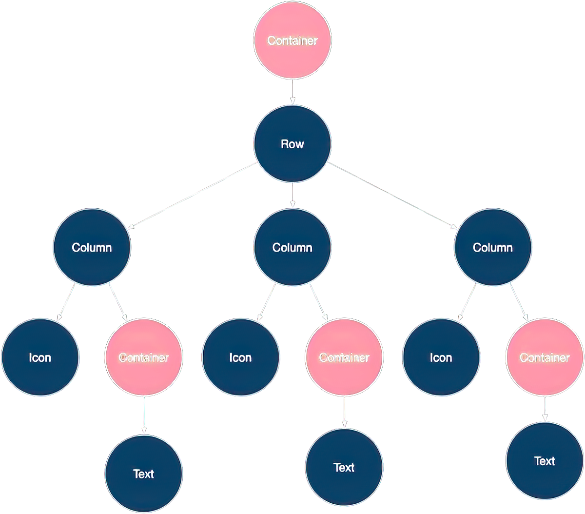

**Detalles clave**

- Cada `Text` se coloca en un `Container` para agregar márgenes.
- La `Row` completa está dentro de un `Container` con relleno.
- Se usan propiedades como `color` en `Icon` y `Text.style` en `Text`.

> [!note] Nota
> Muchas capturas de pantalla en este tutorial se muestran con `debugPaintSizeEnabled = true` para visualizar los límites del diseño.

## 3. Organizar un widget

**Pasos para crear un widget simple**

**1.** Seleccionar un widget de diseño como `Center`.

**2.** Crear un widget visible como `Text`.

**3.** Agregar el widget visible al widget de diseño.

**4.** Incorporar el widget de diseño a la página en `build()`.

### 3.1. **Seleccionar un widget de diseño**

Elige entre una variedad de [widgets de diseño](https://docs.flutter.dev/ui/widgets/layout) según cómo quieras alinear o restringir un widget visible, ya que estas características generalmente se transmiten al widget contenido.

Por ejemplo, podrías usar el widget de diseño `Center` para centrar un widget visible horizontal y verticalmente:

```dart
Center(
  // contenido aquí
)
```

### 3.2. **Crear un widget visible**

Elige un [widget visible](https://docs.flutter.dev/ui/widgets) para que tu aplicación contenga elementos visibles, como texto, imágenes o iconos.

Por ejemplo, podrías usar el widget `Text` para mostrar texto:

```dart
Text('Hola Mundo')
```

### 3.3. **Agregar el widget visible al widget de diseño**

Todos los widgets de diseño tienen una de las siguientes propiedades:

- Una propiedad `child` si toman un solo hijo, como `Center` o `Container`.
- Una propiedad `children` si toman una lista de widgets, como `Row`, `Column`, `ListView` o `Stack`.

Agrega el widget `Text` al widget `Center`:

```dart
const Center(
  child: Text('Hello World'),
),
```

### 3.4. **Agregar el widget de diseño a la página**

Una aplicación de Flutter es en sí misma un widget, y la mayoría de los widgets tienen un método `build()`. Instanciar y devolver un widget en el método `build()` de la aplicación muestra el widget.

Para una aplicación general, puedes agregar el widget `Container` al método `build()` de la aplicación:

```dart
class MyApp extends StatelessWidget {
  const MyApp({super.key});

  @override
  Widget build(BuildContext context) {
    return Container(
      decoration: const BoxDecoration(color: Colors.white),
      child: const Center(
        child: Text(
          'Hello World',
          textDirection: TextDirection.ltr,
          style: TextStyle(fontSize: 32, color: Colors.black87),
        ),
      ),
    );
  }
}
```

Por defecto, una aplicación general no incluye una `AppBar`, título o color de fondo. Si deseas estas características en una aplicación general, debes construirlas tú mismo. Esta aplicación cambia el color de fondo a blanco y el texto a gris oscuro para imitar una aplicación Material.

### 3.5. **Ejecutar tu aplicación**

Después de agregar tus widgets, ejecuta tu aplicación. Al ejecutarla, deberías ver *Hola Mundo*.

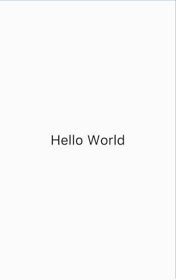

## 4. Organizar múltiples widgets vertical y horizontalmente

**Objetivo**

- `Row` y `Column` son dos de los patrones de diseño más utilizados.
- `Row` y `Column` toman una lista de widgets hijos.
- Un widget hijo puede ser a su vez un `Row`, `Column` u otro widget complejo.
- Puedes especificar cómo un `Row` o `Column` alinea a sus hijos, tanto vertical como horizontalmente.
- Puedes estirar o restringir widgets hijos específicos.
- Puedes especificar cómo los widgets hijos usan el espacio disponible del `Row` o `Column`.

Para crear una fila o columna en Flutter, agregas una lista de widgets hijos a un widget `Row` o `Column`. A su vez, cada hijo puede ser una fila o columna, y así sucesivamente. El siguiente ejemplo muestra cómo es posible anidar filas o columnas dentro de filas o columnas.

Este diseño está organizado como una `Row`. La fila contiene dos hijos: una columna a la izquierda y una imagen a la derecha:

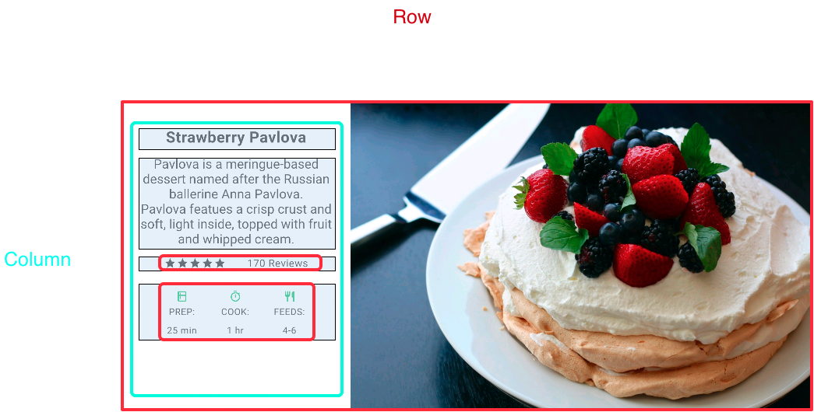

El árbol de widgets de la columna izquierda anida filas y columnas.

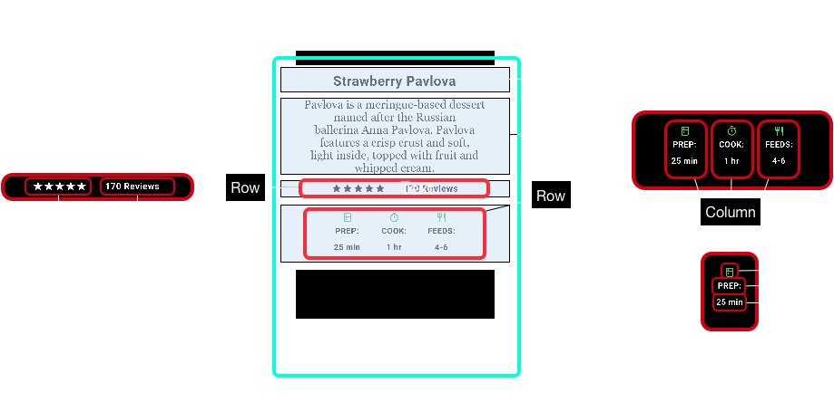

Implementarás parte del código de diseño de Pavlova en [Anidar filas y columnas](https://docs.flutter.dev/ui/layout#nesting-rows-and-columns).

> [!note] Nota
> `Row` y `Column` son widgets primitivos básicos para diseños horizontales y verticales. Estos widgets de bajo nivel permiten la máxima personalización. Flutter también ofrece widgets especializados de alto nivel que podrían ser suficientes para tus necesidades. Por ejemplo, en lugar de `Row`, podrías preferir `ListTile`, un widget fácil de usar con propiedades para iconos iniciales y finales, y hasta 3 líneas de texto. En lugar de `Column`, podrías preferir `ListView`, un diseño similar a una columna que se desplaza automáticamente si su contenido es demasiado largo para el espacio disponible. Para más información, consulta [Widgets de diseño comunes](https://docs.flutter.dev/ui/layout#common-layout-widgets). 

### 4.1. **Alinear widgets**

Puedes controlar cómo una fila o columna alinea a sus hijos usando las propiedades `mainAxisAlignment` y `crossAxisAlignment`. Para una fila, el eje principal corre horizontalmente y el eje transversal verticalmente. Para una columna, el eje principal corre verticalmente y el eje transversal horizontalmente.

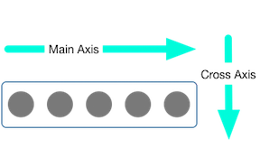

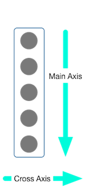

Los enums `MainAxisAlignment` y `CrossAxisAlignment` ofrecen una variedad de constantes para controlar la alineación.

> [!note] Nota
> Cuando agregas imágenes a tu proyecto, necesitas actualizar el archivo `pubspec.yaml` para acceder a ellas. Este ejemplo usa `Image.asset` para mostrar las imágenes. No necesitas hacer esto si estás referenciando imágenes en línea usando `Image.network`. 

En el siguiente ejemplo, cada una de las 3 imágenes tiene 100 píxeles de ancho. La caja de renderizado (en este caso, toda la pantalla) tiene más de 300 píxeles de ancho, por lo que configurar la alineación del eje principal como `spaceEvenly` divide el espacio horizontal libre de manera uniforme entre, antes y después de cada imagen.

```dart
Row(
  mainAxisAlignment: MainAxisAlignment.spaceEvenly,
  children: [
    Image.asset('images/pic1.jpg'),
    Image.asset('images/pic2.jpg'),
    Image.asset('images/pic3.jpg'),
  ],
);
```

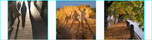

Las columnas funcionan de la misma manera que las filas. El siguiente ejemplo muestra una columna de 3 imágenes, cada una con 100 píxeles de alto. La altura de la caja de renderizado (en este caso, toda la pantalla) es mayor a 300 píxeles, por lo que configurar la alineación del eje principal como `spaceEvenly` divide el espacio vertical libre de manera uniforme entre, encima y debajo de cada imagen.

```dart
Column(
  mainAxisAlignment: MainAxisAlignment.spaceEvenly,
  children: [
    Image.asset('images/pic1.jpg'),
    Image.asset('images/pic2.jpg'),
    Image.asset('images/pic3.jpg'),
  ],
);
```

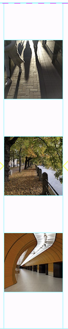

### 4.2. **Dimensionar widgets**

Cuando un diseño es demasiado grande para un dispositivo, aparece un patrón amarillo y negro a lo largo del borde afectado. Aquí hay un ejemplo de una fila que es demasiado ancha:

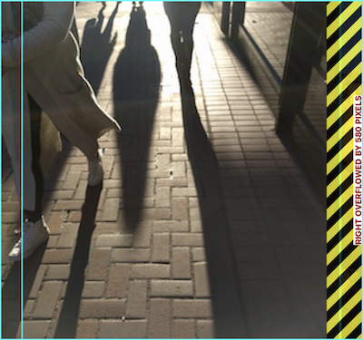

Los widgets pueden dimensionarse para ajustarse dentro de una fila o columna usando el widget `Expanded`. Para solucionar el ejemplo anterior donde la fila de imágenes es demasiado ancha para su caja de renderizado, envuelve cada imagen con un widget `Expanded`.

```dart
Row(
  crossAxisAlignment: CrossAxisAlignment.center,
  children: [
    Expanded(child: Image.asset('images/pic1.jpg')),
    Expanded(child: Image.asset('images/pic2.jpg')),
    Expanded(child: Image.asset('images/pic3.jpg')),
  ],
);
```

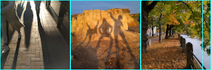

Quizás quieras que un widget ocupe el doble de espacio que sus hermanos. Para esto, usa la propiedad `flex` del widget `Expanded`, un entero que determina el factor de flexión para un widget. El factor de flexión predeterminado es 1. El siguiente código establece el factor de flexión de la imagen del medio en 2:

```dart
Row(
  crossAxisAlignment: CrossAxisAlignment.center,
  children: [
    Expanded(child: Image.asset('images/pic1.jpg')),
    Expanded(flex: 2, child: Image.asset('images/pic2.jpg')),
    Expanded(child: Image.asset('images/pic3.jpg')),
  ],
);
```

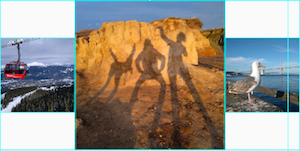

### 4.3. **Agrupar widgets**

Por defecto, una fila o columna ocupa tanto espacio como sea posible a lo largo de su eje principal, pero si deseas agrupar a los hijos más juntos, configura su `mainAxisSize` como `MainAxisSize.min`. El siguiente ejemplo usa esta propiedad para agrupar los iconos de estrellas.

```dart
Row(
  mainAxisSize: MainAxisSize.min,
  children: [
    Icon(Icons.star, color: Colors.green[500]),
    Icon(Icons.star, color: Colors.green[500]),
    Icon(Icons.star, color: Colors.green[500]),
    const Icon(Icons.star, color: Colors.black),
    const Icon(Icons.star, color: Colors.black),
  ],
)
```

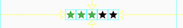

### 4.4. **Anidar filas y columnas**

El marco de diseño permite anidar filas y columnas dentro de filas y columnas tan profundamente como necesites. Veamos el código para la sección delineada del siguiente diseño:


La sección delineada se implementa como dos filas. La fila de calificaciones contiene cinco estrellas y el número de reseñas. La fila de iconos contiene tres columnas de iconos y texto.

El árbol de widgets para la fila de calificaciones:

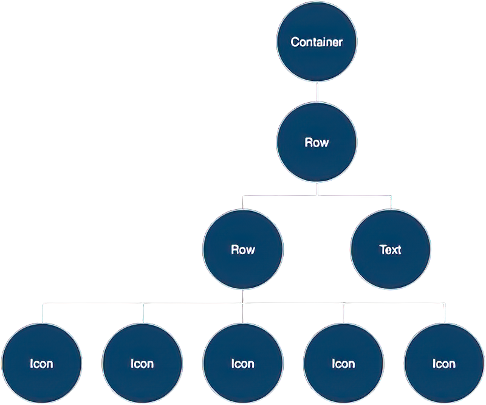

La variable `ratings` crea una fila que contiene una fila más pequeña de 5 iconos de estrellas y texto:

```dart
final stars = Row(
  mainAxisSize: MainAxisSize.min,
  children: [
    Icon(Icons.star, color: Colors.green[500]),
    Icon(Icons.star, color: Colors.green[500]),
    Icon(Icons.star, color: Colors.green[500]),
    const Icon(Icons.star, color: Colors.black),
    const Icon(Icons.star, color: Colors.black),
  ],
);

final ratings = Container(
  padding: const EdgeInsets.all(20),
  child: Row(
    mainAxisAlignment: MainAxisAlignment.spaceEvenly,
    children: [
      stars,
      const Text(
        '170 Reseñas',
        style: TextStyle(
          color: Colors.black,
          fontWeight: FontWeight.w800,
          fontFamily: 'Roboto',
          letterSpacing: 0.5,
          fontSize: 20,
        ),
      ),
    ],
  ),
);
```

> [!note] Nota 
> Para minimizar la confusión visual que puede resultar del código de diseño fuertemente anidado, implementa partes de la interfaz de usuario en variables y funciones.

La fila de iconos, debajo de la fila de calificaciones, contiene 3 columnas; cada columna contiene un icono y dos líneas de texto, como puedes ver en su árbol de widgets:

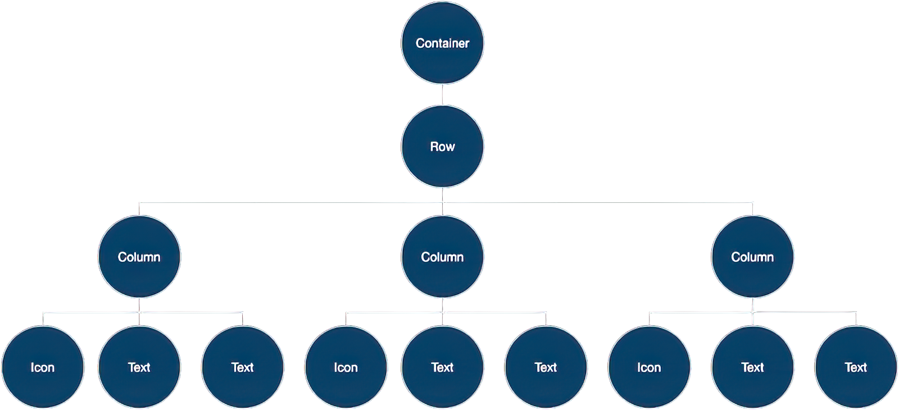

La variable `iconList` define la fila de iconos:

```dart
const descTextStyle = TextStyle(
  color: Colors.black,
  fontWeight: FontWeight.w800,
  fontFamily: 'Roboto',
  letterSpacing: 0.5,
  fontSize: 18,
  height: 2,
);

// DefaultTextStyle.merge() permite crear un estilo de texto
// predeterminado que heredan su hijo y todos los hijos posteriores.
final iconList = DefaultTextStyle.merge(
  style: descTextStyle,
  child: Container(
    padding: const EdgeInsets.all(20),
    child: Row(
      mainAxisAlignment: MainAxisAlignment.spaceEvenly,
      children: [
        Column(
          children: [
            Icon(Icons.kitchen, color: Colors.green[500]),
            const Text('PREP:'),
            const Text('25 min'),
          ],
        ),
        Column(
          children: [
            Icon(Icons.timer, color: Colors.green[500]),
            const Text('COOK:'),
            const Text('1 hr'),
          ],
        ),
        Column(
          children: [
            Icon(Icons.restaurant, color: Colors.green[500]),
            const Text('FEEDS:'),
            const Text('4-6'),
          ],
        ),
      ],
    ),
  ),
);
```

La variable `leftColumn` contiene las filas de calificaciones e iconos, así como el título y el texto que describe la Pavlova:

```dart
final leftColumn = Container(
  padding: const EdgeInsets.fromLTRB(20, 30, 20, 20),
  child: Column(children: [titleText, subTitle, ratings, iconList]),
);
```

La columna izquierda se coloca en un `SizedBox` para restringir su ancho. Finalmente, la interfaz de usuario se construye con toda la fila (que contiene la columna izquierda y la imagen) dentro de una `Card`.

La imagen de Pavlova es de *Pixabay*. Puedes incrustar una imagen de la red usando `Image.network()`, pero para este ejemplo, la imagen se guarda en un directorio de imágenes del proyecto, se agrega al archivo `pubspec` y se accede usando `Images.asset()`.

```dart
body: Center(
  child: Container(
    margin: const EdgeInsets.fromLTRB(0, 40, 0, 30),
    height: 600,
    child: Card(
      child: Row(
        crossAxisAlignment: CrossAxisAlignment.start,
        children: [SizedBox(width: 440, child: leftColumn), mainImage],
      ),
    ),
  ),
),
```

> [!note] Consejo
> El ejemplo de Pavlova funciona mejor horizontalmente en un dispositivo ancho, como una tableta. Si estás ejecutando este ejemplo en el simulador de iOS, puedes seleccionar un dispositivo diferente usando el menú **Hardware > Device.** Para este ejemplo, recomendamos el iPad Pro. Puedes cambiar su orientación al modo horizontal usando **Hardware > Rotate.** También puedes cambiar el tamaño de la ventana del simulador (sin cambiar el número de píxeles lógicos) usando **Window > Scale.**

## 5. Widgets de diseño comunes

Flutter tiene una amplia biblioteca de widgets de diseño. Aquí hay algunos de los más utilizados. El objetivo es que puedas comenzar rápidamente, en lugar de abrumarte con una lista completa. Para información sobre otros widgets disponibles consulta el [Catálogo de widgets](https://docs.flutter.dev/ui/widgets). Además, las páginas de widgets en la documentación de la API a menudo hacen sugerencias sobre widgets similares que podrían adaptarse mejor a tus necesidades.

Los siguientes widgets se dividen en dos categorías: widgets estándar de la [biblioteca de widgets](https://api.flutter.dev/flutter/widgets/widgets-library.html) y widgets especializados de la [Material Library](https://api.flutter.dev/flutter/material/material-library.html). Cualquier aplicación puede usar la biblioteca de widgets, pero solo las aplicaciones Material pueden usar la biblioteca de componentes Material.


|     |     |
| --- | --- |
| `Container`| Agrega relleno, márgenes, bordes, color de fondo u otras decoraciones a un widget.|
| `GridView`| Organiza widgets como una cuadrícula desplazable.|
| `ListView`| Organiza widgets como una lista desplazable.|
| `Stack`| Superpone un widget encima de otro.|

### 5.1. **Container**

Muchos diseños hacen un uso liberal de `Container` para separar widgets usando relleno, o para agregar bordes o márgenes. Puedes cambiar el fondo del dispositivo colocando todo el diseño en un `Container` y cambiando su color o imagen de fondo.

#### Resumen (Container)

- Agrega relleno, márgenes, bordes
- Cambia el color o imagen de fondo
- Contiene un solo widget hijo, pero ese hijo puede ser una `Row`, `Column` o incluso la raíz de un árbol de widgets

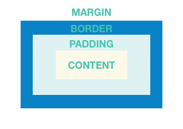

#### Ejemplos (Container)

Este diseño consiste en una columna con dos filas, cada una conteniendo 2 imágenes. Se usa un `Container` para cambiar el color de fondo de la columna a un gris más claro.

```dart
Widget _buildImageColumn() {
  return Container(
    decoration: const BoxDecoration(color: Colors.black26),
    child: Column(children: [_buildImageRow(1), _buildImageRow(3)]),
  );
}
```

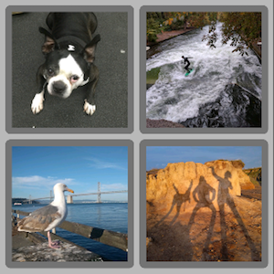

También se usa un `Container` para agregar un borde redondeado y márgenes a cada imagen:

```dart
Widget _buildDecoratedImage(int imageIndex) => Expanded(
  child: Container(
    decoration: BoxDecoration(
      border: Border.all(width: 10, color: Colors.black38),
      borderRadius: const BorderRadius.all(Radius.circular(8)),
    ),
    margin: const EdgeInsets.all(4),
    child: Image.asset('images/pic$imageIndex.jpg'),
  ),
);

Widget _buildImageRow(int imageIndex) => Row(
  children: [
    _buildDecoratedImage(imageIndex),
    _buildDecoratedImage(imageIndex + 1),
  ],
);
```

### 5.2. **GridView**

Usa `GridView` para organizar widgets como una lista bidimensional. `GridView` proporciona dos listas prefabricadas, o puedes construir tu propia cuadrícula personalizada. Cuando un `GridView` detecta que su contenido es demasiado largo para la caja de renderizado, se desplaza automáticamente.

#### Resumen (GridView)

- Organiza widgets en una cuadrícula
- Detecta cuando el contenido de la columna excede la caja de renderizado y proporciona desplazamiento automático
- Construye tu propia cuadrícula personalizada, o usa una de las proporcionadas:
  - `GridView.count` te permite especificar el número de columnas
  - `GridView.extent` te permite especificar el ancho máximo en píxeles de un mosaico

> [!note]
> Cuando muestres una lista bidimensional donde es importante qué fila y columna ocupa una celda (por ejemplo, es la entrada en la columna "calorías" para la fila "aguacate"), usa `Table`.

#### Ejemplos (GridView)

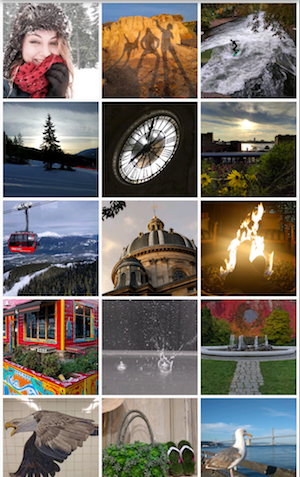

Usa `GridView.extent` para crear una cuadrícula con mosaicos de un máximo de 150 píxeles de ancho.

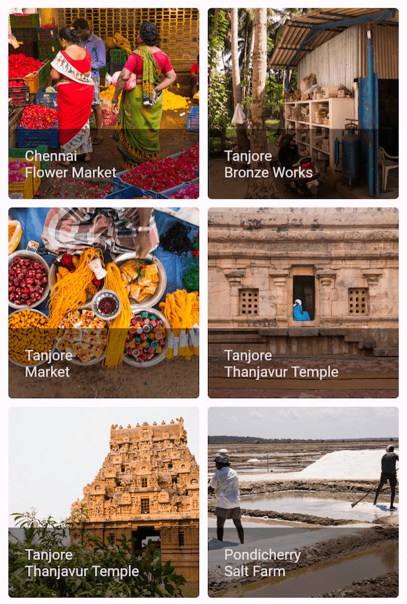

Usa `GridView.count` para crear una cuadrícula de 2 mosaicos de ancho en modo retrato y 3 mosaicos de ancho en modo paisaje. Los títulos se crean configurando la propiedad `footer` para cada `GridTile`.

```dart
Widget _buildGrid() => GridView.extent(
  maxCrossAxisExtent: 150,
  padding: const EdgeInsets.all(4),
  mainAxisSpacing: 4,
  crossAxisSpacing: 4,
  children: _buildGridTileList(30),
);

// Las imágenes se guardan con nombres pic0.jpg, pic1.jpg...pic29.jpg.
// El constructor List.generate() permite una manera fácil de crear
// una lista cuando los objetos tienen un patrón de nombres predecible.
List<Widget> _buildGridTileList(int count) =>
    List.generate(count, (i) => Image.asset('images/pic$i.jpg'));
```

### 5.3. **ListView**

`ListView`, un widget similar a una columna, proporciona desplazamiento automático cuando su contenido es demasiado largo para su caja de renderizado.

#### Resumen (ListView)

- Una `Column` especializada para organizar una lista de cajas
- Puede organizarse horizontal o verticalmente
- Detecta cuando su contenido no cabe y proporciona desplazamiento
- Menos configurable que `Column`, pero más fácil de usar y admite desplazamiento

#### Ejemplos (ListView)


Usa `ListView` para mostrar una lista de negocios usando `ListTile`s. Un `Divider` separa los cines de los restaurantes.

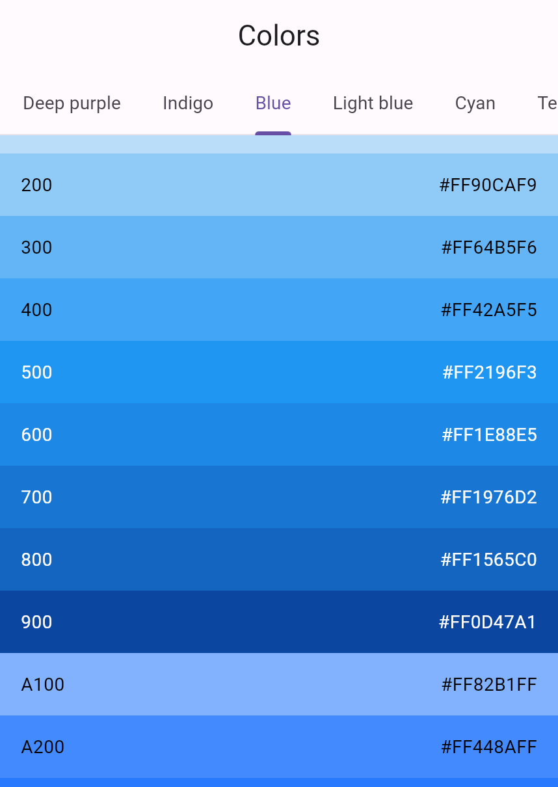

Usa `ListView` para mostrar los `Colors` de la [paleta de diseño Material 2](https://m2.material.io/design/color/the-color-system.html#tools-for-picking-colors) para una familia de colores en particular.

```dart
Widget _buildList() {
  return ListView(
    children: [
      _tile('CineArts en el Empire', '85 W Portal Ave', Icons.theaters),
      _tile('The Castro Theater', '429 Castro St', Icons.theaters),
      _tile('Alamo Drafthouse Cinema', '2550 Mission St', Icons.theaters),
      _tile('Roxie Theater', '3117 16th St', Icons.theaters),
      _tile(
        'United Artists Stonestown Twin',
        '501 Buckingham Way',
        Icons.theaters,
      ),
      _tile('AMC Metreon 16', '135 4th St #3000', Icons.theaters),
      const Divider(),
      _tile('K\'s Kitchen', '757 Monterey Blvd', Icons.restaurant),
      _tile('Emmy\'s Restaurant', '1923 Ocean Ave', Icons.restaurant),
      _tile('Chaiya Thai Restaurant', '272 Claremont Blvd', Icons.restaurant),
      _tile('La Ciccia', '291 30th St', Icons.restaurant),
    ],
  );
}

ListTile _tile(String title, String subtitle, IconData icon) {
  return ListTile(
    title: Text(
      title,
      style: const TextStyle(fontWeight: FontWeight.w500, fontSize: 20),
    ),
    subtitle: Text(subtitle),
    leading: Icon(icon, color: Colors.blue[500]),
  );
}
```

### 5.4. **Stack**

Usa `Stack` para organizar widgets encima de un widget base, a menudo una imagen. Los widgets pueden superponerse completamente o parcialmente al widget base.

#### Resumen (Stack)

- Usa para widgets que se superponen a otro widget
- El primer widget en la lista de hijos es el widget base; los hijos posteriores se superponen encima de ese widget base
- El contenido de un `Stack` no puede desplazarse
- Puedes elegir recortar hijos que excedan la caja de renderizado

#### Ejemplos (Stack)


Usa `Stack` para superponer un `Container` (que muestra su `Text` en un fondo negro translúcido) encima de un `CircleAvatar`. El `Stack` desplaza el texto usando la propiedad `alignment` y `Alignment`s.

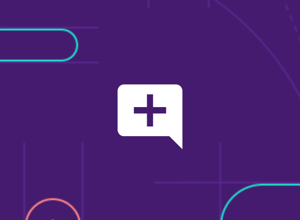

Usa `Stack` para superponer un icono encima de una imagen.

```dart
Widget _buildStack() {
  return Stack(
    alignment: const Alignment(0.6, 0.6),
    children: [
      const CircleAvatar(
        backgroundImage: AssetImage('images/pic.jpg'),
        radius: 100,
      ),
      Container(
        decoration: const BoxDecoration(color: Colors.black45),
        child: const Text(
          'Mia B',
          style: TextStyle(
            fontSize: 20,
            fontWeight: FontWeight.bold,
            color: Colors.white,
          ),
        ),
      ),
    ],
  );
}
```

### 5.5. **Card**

Una `Card`, de la *Material Library*, contiene fragmentos de información relacionados y puede componerse de casi cualquier widget, pero a menudo se usa con `ListTile`. `Card` tiene un solo hijo, pero su hijo puede ser una columna, fila, lista, cuadrícula u otro widget que admita múltiples hijos. Por defecto, una `Card` reduce su tamaño a 0 por 0 píxeles. Puedes usar `SizedBox` para restringir el tamaño de una tarjeta.

En Flutter, una `Card` tiene esquinas ligeramente redondeadas y una sombra paralela, dándole un efecto 3D. Cambiar la propiedad `elevation` de una `Card` te permite controlar el efecto de sombra. Por ejemplo, configurar la elevación a 24 eleva visualmente la `Card` más lejos de la superficie y hace que la sombra se disperse más. Para una lista de valores de elevación admitidos, consulta [Elevación](https://m3.material.io/styles/elevation) en las [directrices de Material](https://m3.material.io/styles). Especificar un valor no admitido deshabilita completamente la sombra paralela.

#### Resumen (Card)

- Implementa una tarjeta Material
- Usada para presentar fragmentos de información relacionados
- Acepta un solo hijo, pero ese hijo puede ser una `Row`, `Column` u otro widget que contenga una lista de hijos
- Se muestra con esquinas redondeadas y una sombra paralela
- El contenido de una `Card` no puede desplazarse
- De la [biblioteca Material](https://api.flutter.dev/flutter/material/material-library.html)
#### Ejemplos (Card)

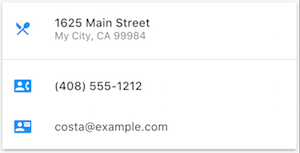

Una `Card` que contiene 3 `ListTile`s y dimensionada envolviéndola con un `SizedBox`. Un `Divider` separa el primer y segundo `ListTile`.

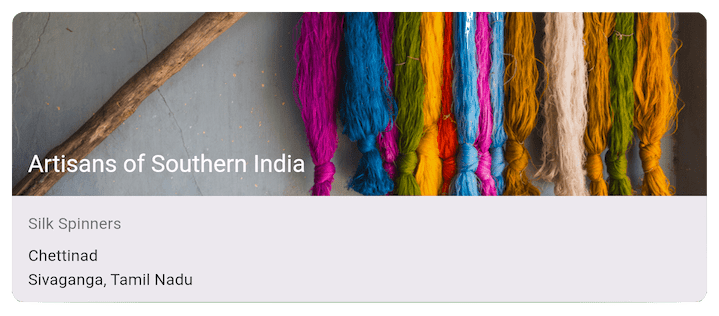

Una `Card` que contiene una imagen y texto.

```dart
Widget _buildCard() {
  return SizedBox(
    height: 210,
    child: Card(
      child: Column(
        children: [
          ListTile(
            title: const Text(
              '1625 Main Street',
              style: TextStyle(fontWeight: FontWeight.w500),
            ),
            subtitle: const Text('My City, CA 99984'),
            leading: Icon(Icons.restaurant_menu, color: Colors.blue[500]),
          ),
          const Divider(),
          ListTile(
            title: const Text(
              '(408) 555-1212',
              style: TextStyle(fontWeight: FontWeight.w500),
            ),
            leading: Icon(Icons.contact_phone, color: Colors.blue[500]),
          ),
          ListTile(
            title: const Text('costa@example.com'),
            leading: Icon(Icons.contact_mail, color: Colors.blue[500]),
          ),
        ],
      ),
    ),
  );
}
```

### 5.6. **ListTile**

Usa `ListTile`, un widget de fila especializado de la biblioteca Material, para crear fácilmente una fila que contenga hasta 3 líneas de texto y iconos iniciales y finales opcionales. `ListTile` se usa más comúnmente en `Card` o `ListView`, pero puede usarse en otros lugares.

#### Resumen (ListTile)

- Una fila especializada que contiene hasta 3 líneas de texto e iconos opcionales
- Menos configurable que `Row`, pero más fácil de usar
- De la [biblioteca Material](https://api.flutter.dev/flutter/material/material-library.html)

#### Ejemplos (ListTile)


Una `Card` que contiene 3 `ListTile`.

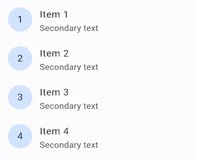

Usa `ListTile` con widgets iniciales.
